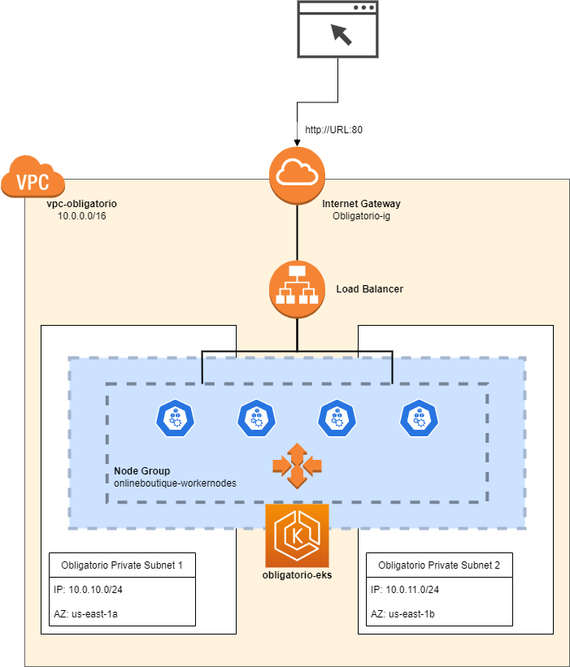
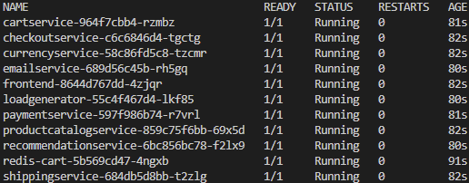
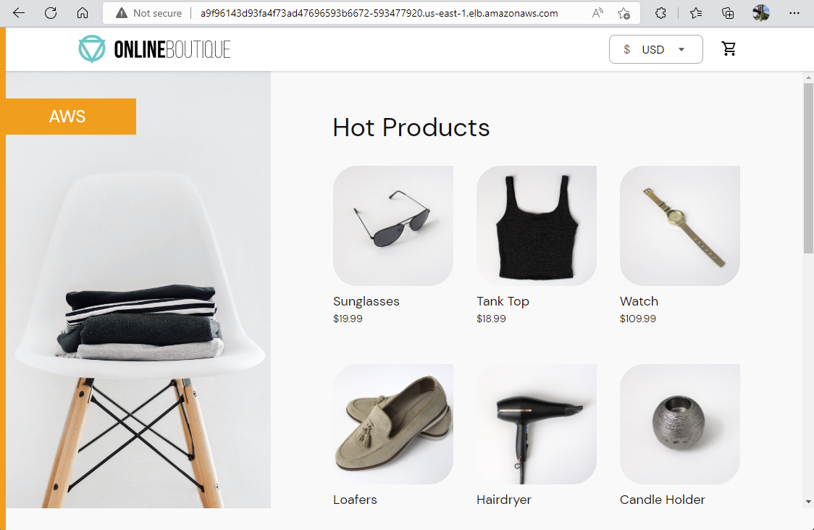

# Introducción
Se le solicita a BitBeat el despliegue de la aplicación web online-boutique y su infraestructura necesaria sobre la cloud pública AWS.

# Arquitectura
La arquitectura de la aplicación esta basada en 11 microservicios que se intercomunican, estos corren en pods Kubernetes sobre un node group creado en un cluster EKS con Load Balancing entre 2 Availability Zones y Auto-Scaling de hasta 4 instancias.



Para lograr la implementación de esta arquitectura utilizamos los siguientes recursos.
```
1x Route Table "obligatorio_public-rt"
1x VPC "vpc-obligatorio"
1x Internet Gateway "obligatorio-ig"
2x Subredes "obligatorio-private-subnet1", y "obligatorio-private-subnet2"
1x EKS Cluster "obligatorio-eks"
1x Node Group "onlineboutique-workernodes"
1x Kubernetes Load Balancer
Instancias EC2 "t2.medium" (con auto-scaling)
 
```

# Implementación
## Generación de imágenes
A partir de los archivos dockerfile provistos se generaron las imagenes Docker, las cuales se centralizaron en Dockerhub para luego ser utilizadas en el deploy.

## Infraestructura de base en AWS

Mediante el uso de la herramienta de IaC Terraform, se describió todo el despliegue, logrando su automatización completa.

### Terraform
Para el despliegue del ambiente mediante Terraform se utilizó la siguiente estructura de archivos.
```
Terraform
    - aws
        - app
        - data.tf
        - ekscluster.tf
        - network.tf
        - provider.tf
        - variables.tf
        - versions.tf
```
Dentro de **"providers.tf"**, en este caso, describimos únicamente los datos necesarios para acceder a nuestra cuenta AWS a ser utilizada para la implementación.
Mientras que **"variables.tf"** define los datos de conexión.

En **"versions.tf"** declaramos la minima version de Terraform para soportar los providers utilizados.

El archivo **"data.tf"** obtiene el IAM Rol a ser usado por la creación del EKS Cluster.

Los archivos **"ekscluster.tf"**, y **"network.tf"** definen la infraestructura.

## Despliegue de la aplicación
Para la implementación de los microservicios que conforman la aplicación, se utilizaron los YAML brindados, llamando desde Dockerhub a las imagenes previamente construidas.


### Terraform
Estructura de archivos utilizada para el despliegue de la aplicación.
```
Terraform
    - aws
        -app
            - Kubernetes
            - data.tf
            - online-boutique.tf
            - provider.tf
            - variables.tf
            - versions.tf
```
En el caso de la aplicación, utilizamos un directorio **"Kubernetes"** donde centralizamos todos los YAML a ser usados por el deployment.

Para su despliegue mediante terraform hicimos uso del provider "kubectl", donde mediante el modulo data extrajimos los datos necesarios para el correcto funcionamiento.

Haciendo uso de dicho provider construimos el archivo **"online-boutique.tf"** donde llamamos al contenido de cada uno de los YAML, ejecutándolos en su orden correcto.

Cabe destacar, que para su correcta implementación debe existir previamente la infraestructura desplegada en AWS.

Para lograr la ejecución automatizada luego de tener la infraestructura subyacente se generó un script bash **"deploy.sh"** que ejecuta los despliegues en el orden correcto.

Al finalizar su ejecución, el script desplegará la URL del LoadBalancer para acceder al sitio web.

### Resultado final del despliegue





---
**Nicolás Díaz 194778**\
**Nicolás Varela 159693**